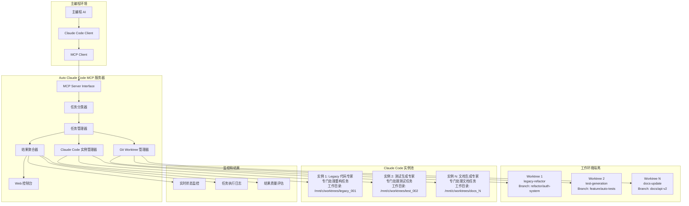

# Auto Claude Code - MCP 任务分发系统设计

## 项目概述

将 Auto Claude Code 从简单的路径转换代理工具扩展为支持 MCP (Model Context Protocol) 的智能任务分发系统。主编程 AI 可以通过我们的 MCP 服务器分发任务给多个 Claude Code 实例，实现异步执行和结果聚合。

### 核心价值升级
- **智能任务分发**：主 AI 可以将复杂任务分解并分发给多个 Claude Code 实例
- **异步执行管理**：支持并发执行多个编程任务，提高效率
- **结果聚合展示**：在统一控制台显示所有任务的执行状态和结果
- **工作目录隔离**：利用 Git Worktrees 实现完全独立的工作环境

## Claude Code 独特能力分析

基于最新研究，Claude Code 具有以下独一无二的能力，这些是主 AI 无法替代的：

### 🎯 Claude Code 的核心优势

#### 1. **Agentic 编程能力**
- **直接文件操作**：可以直接读取、修改、创建文件，而不仅仅是生成代码
- **命令行集成**：在 WSL 环境中执行 shell 命令、运行测试、管理 Git 操作
- **多步骤工作流**：能够执行复杂的多步骤编程任务，如重构→测试→提交的完整流程

#### 2. **深度代码理解和推理**
- **大型代码库分析**：200K token 上下文窗口，能理解整个项目架构
- **Legacy 代码专家**：擅长分析和重构遗留代码，提供详细的架构解释
- **跨文件依赖分析**：理解复杂的模块间依赖关系

#### 3. **高质量文档生成**
- **自动化文档**：从代码自动生成专业级文档
- **架构说明**：为复杂系统生成清晰的架构文档和设计决策说明
- **代码注释**：生成高质量的内联注释和 API 文档

#### 4. **精确的代码重构**
- **大规模重构**：能够安全地进行跨文件的大规模代码重构
- **性能优化**：识别性能瓶颈并提供优化建议
- **代码质量提升**：遵循最佳实践，提升代码可维护性

### 🚫 主 AI 应该保留的任务类型

为避免功能重叠，以下任务应由主 AI 处理：
- **需求分析和架构设计**：高层次的系统设计和技术选型
- **创意编程和原型设计**：新功能的概念验证和快速原型
- **跨语言翻译**：不同编程语言间的代码转换
- **算法设计**：复杂算法的设计和数学建模
- **技术咨询**：技术栈选择、最佳实践建议

## MCP 服务器任务类型定义

### 支持的任务类型

我们的 MCP 服务器将明确支持以下 Claude Code 专属任务：

#### 📁 **代码库维护任务**
```json
{
  "task_type": "codebase_maintenance",
  "subtypes": [
    "legacy_refactor",      // 遗留代码重构
    "dependency_update",    // 依赖更新和兼容性修复
    "code_cleanup",         // 代码清理和优化
    "documentation_sync"    // 文档与代码同步
  ]
}
```

#### 🔧 **自动化开发任务**
```json
{
  "task_type": "automated_development",
  "subtypes": [
    "test_generation",      // 自动生成单元测试
    "ci_cd_setup",         // CI/CD 流水线配置
    "build_optimization",   // 构建过程优化
    "git_workflow"         // Git 工作流自动化
  ]
}
```

#### 📊 **代码分析任务**
```json
{
  "task_type": "code_analysis",
  "subtypes": [
    "security_audit",       // 安全漏洞扫描
    "performance_analysis", // 性能瓶颈分析
    "dependency_audit",     // 依赖关系审计
    "code_metrics"         // 代码质量指标分析
  ]
}
```

#### 📝 **文档生成任务**
```json
{
  "task_type": "documentation",
  "subtypes": [
    "api_docs",            // API 文档生成
    "architecture_docs",   // 架构文档
    "user_guides",         // 用户指南
    "changelog_generation" // 变更日志生成
  ]
}
```

#### 🔄 **迁移和升级任务**
```json
{
  "task_type": "migration",
  "subtypes": [
    "framework_migration",  // 框架迁移
    "database_migration",   // 数据库迁移
    "api_versioning",      // API 版本升级
    "platform_porting"    // 平台移植
  ]
}
```

## 架构设计

### 系统架构图



### 核心组件设计

#### 1. **任务分类器 (Task Classifier)**
```go
type TaskClassifier struct {
    supportedTypes map[string]TaskDefinition
}

type TaskDefinition struct {
    Type        string   `json:"type"`
    Subtypes    []string `json:"subtypes"`
    Description string   `json:"description"`
    Capabilities []string `json:"capabilities"`
    Restrictions []string `json:"restrictions"`
}

func (tc *TaskClassifier) ValidateTask(task *Task) error {
    // 验证任务是否属于 Claude Code 的专长领域
    // 拒绝应该由主 AI 处理的任务类型
}
```

#### 2. **智能实例分配器**
```go
type InstanceAllocator struct {
    instances map[string]*ClaudeCodeInstance
    expertise map[string][]string // 实例专长映射
}

func (ia *InstanceAllocator) AllocateInstance(taskType string) (*ClaudeCodeInstance, error) {
    // 根据任务类型分配最适合的 Claude Code 实例
    // 考虑实例当前负载和专长匹配度
}
```

## MCP 协议接口设计

### 工具定义

```json
{
  "tools": [
    {
      "name": "create_coding_task",
      "description": "创建一个适合 Claude Code 处理的编程任务",
      "inputSchema": {
        "type": "object",
        "properties": {
          "task_type": {
            "type": "string",
            "enum": ["codebase_maintenance", "automated_development", "code_analysis", "documentation", "migration"],
            "description": "任务类型"
          },
          "subtype": {
            "type": "string",
            "description": "具体子任务类型"
          },
          "repository_path": {
            "type": "string",
            "description": "目标代码库路径"
          },
          "branch_name": {
            "type": "string",
            "description": "工作分支名称"
          },
          "requirements": {
            "type": "string",
            "description": "详细任务要求"
          },
          "priority": {
            "type": "string",
            "enum": ["low", "medium", "high", "urgent"],
            "default": "medium"
          }
        },
        "required": ["task_type", "subtype", "repository_path", "requirements"]
      }
    },
    {
      "name": "get_task_status",
      "description": "获取任务执行状态",
      "inputSchema": {
        "type": "object",
        "properties": {
          "task_id": {
            "type": "string",
            "description": "任务ID"
          }
        },
        "required": ["task_id"]
      }
    },
    {
      "name": "list_active_tasks",
      "description": "列出所有活跃任务",
      "inputSchema": {
        "type": "object",
        "properties": {
          "filter": {
            "type": "string",
            "enum": ["all", "running", "completed", "failed"],
            "default": "all"
          }
        }
      }
    },
    {
      "name": "get_supported_task_types",
      "description": "获取支持的任务类型列表",
      "inputSchema": {
        "type": "object",
        "properties": {}
      }
    }
  ]
}
```

### 使用示例

主编程 AI 可以这样使用我们的 MCP 服务器：

```javascript
// 1. 查询支持的任务类型
const supportedTypes = await mcp.call("get_supported_task_types", {});

// 2. 创建代码重构任务
const refactorTask = await mcp.call("create_coding_task", {
  task_type: "codebase_maintenance",
  subtype: "legacy_refactor",
  repository_path: "/path/to/legacy/project",
  branch_name: "refactor/auth-module",
  requirements: "重构认证模块，提取公共接口，添加单元测试，更新文档",
  priority: "high"
});

// 3. 创建文档生成任务
const docsTask = await mcp.call("create_coding_task", {
  task_type: "documentation",
  subtype: "api_docs",
  repository_path: "/path/to/api/project",
  branch_name: "docs/api-v2",
  requirements: "为新的 API v2 生成完整的 OpenAPI 文档和使用示例",
  priority: "medium"
});

// 4. 监控任务状态
const status = await mcp.call("get_task_status", {
  task_id: refactorTask.task_id
});
```

## 任务执行流程

### 1. **任务接收和验证**
```
主 AI 请求 → MCP 服务器 → 任务分类器 → 验证任务类型 → 创建任务实例
```

### 2. **环境准备**
```
Git Worktree 创建 → 分支切换 → 依赖安装 → 环境配置
```

### 3. **实例分配和执行**
```
选择专业实例 → 路径转换 → WSL 环境启动 → Claude Code 执行
```

### 4. **结果处理**
```
执行监控 → 结果收集 → 质量评估 → 状态更新 → 通知主 AI
```

## 质量保证机制

### 1. **任务适配性检查**
- 验证任务是否适合 Claude Code 处理
- 拒绝应该由主 AI 处理的创意性或设计性任务
- 确保任务有明确的技术要求和验收标准

### 2. **执行质量监控**
- 代码质量检查（语法、风格、测试覆盖率）
- 安全性扫描（漏洞检测、依赖安全）
- 性能影响评估（构建时间、运行时性能）

### 3. **结果验证**
- 自动化测试执行
- 代码审查报告生成
- 文档完整性检查

## 配置示例

### MCP 服务器配置
```yaml
# mcp_server_config.yaml
server:
  name: "auto-claude-code-mcp"
  version: "1.0.0"
  description: "Claude Code 任务分发系统"

task_types:
  codebase_maintenance:
    enabled: true
    max_concurrent: 3
    timeout: "2h"
    
  automated_development:
    enabled: true
    max_concurrent: 5
    timeout: "1h"
    
  code_analysis:
    enabled: true
    max_concurrent: 2
    timeout: "30m"

instances:
  legacy_expert:
    specialization: ["legacy_refactor", "code_cleanup"]
    max_context: "200k"
    
  test_expert:
    specialization: ["test_generation", "ci_cd_setup"]
    max_context: "150k"
    
  docs_expert:
    specialization: ["api_docs", "architecture_docs"]
    max_context: "100k"
```

## 监控和日志

### 实时监控指标
- 活跃任务数量
- 平均执行时间
- 成功率统计
- 资源使用情况

### 详细日志记录
- 任务创建和分配日志
- Claude Code 执行日志
- 错误和异常日志
- 性能指标日志

这个设计确保了 Claude Code 专注于其独特优势，避免与主 AI 功能重叠，同时提供了完整的任务管理和监控能力。 