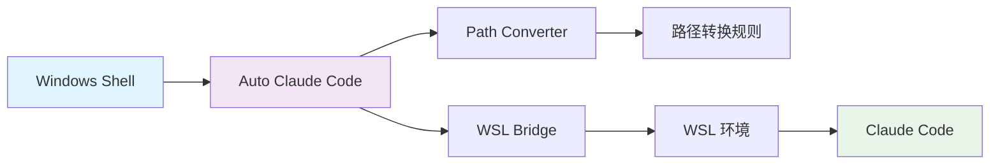
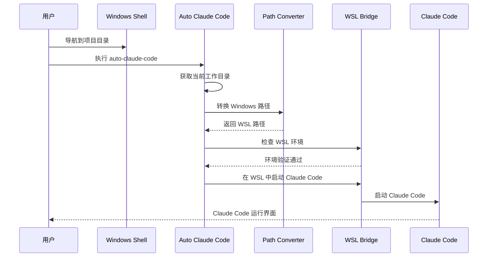

# Auto Claude Code - 项目总览

## 项目简介

Auto Claude Code 是一个专为 Windows + WSL 开发环境设计的轻量级代理工具。它解决了在 Windows 主机上工作但需要在 WSL 环境中运行 Claude Code 的痛点，通过智能路径转换和环境桥接，实现一键启动体验。

## 核心价值主张

### 🎯 解决的核心问题
- **环境割裂**：Windows 主机与 WSL 开发环境之间的切换摩擦
- **路径复杂**：Windows 路径到 WSL 挂载路径的手动转换繁琐
- **工具启动**：需要多步操作才能在正确的 WSL 路径下启动 Claude Code

### ✨ 提供的核心价值
- **一键启动**：在任意 Windows 目录下直接启动对应 WSL 路径的 Claude Code
- **智能转换**：自动处理 Windows 路径到 WSL 路径的转换逻辑
- **无缝集成**：与现有开发工作流完美融合，零配置可用

## 架构概览

### 高层架构



### 核心组件

1. **CLI 接口层**
   - 命令行参数解析
   - 用户交互处理
   - 错误信息展示

2. **路径转换层**
   - Windows → WSL 路径映射
   - 特殊路径处理（UNC、相对路径等）
   - 自定义映射规则支持

3. **WSL 桥接层**
   - WSL 环境检测与验证
   - 跨环境命令执行
   - stdio 流转发

4. **配置管理层**
   - 多级配置支持（文件、环境变量、命令行）
   - 动态配置热更新
   - 默认值智能推断

## 技术特点

### 🛠️ 技术栈
- **语言**：Go 1.21+（单一二进制，无运行时依赖）
- **架构**：模块化设计，接口驱动
- **依赖**：最小化外部依赖，主要使用标准库
- **平台**：专为 Windows + WSL 环境优化

### 🚀 性能特征
- **启动速度**：< 100ms 冷启动时间
- **内存占用**：< 10MB 运行时内存
- **文件大小**：< 5MB 单一可执行文件
- **兼容性**：支持 WSL1 和 WSL2

### 🔧 设计原则

#### 1. 简单优先
- 零配置可用：开箱即用，无需复杂设置
- 单一职责：专注路径转换和环境桥接
- 最小依赖：减少外部依赖和复杂性

#### 2. 智能化
- 自动检测：WSL 发行版、Claude Code 可用性
- 智能转换：处理各种路径格式和特殊情况
- 错误恢复：提供友好的错误信息和解决建议

#### 3. 可扩展
- 插件化架构：模块间松耦合
- 配置灵活：支持多种配置方式
- 接口抽象：便于功能扩展和测试

## 使用流程

### 标准工作流



### 典型使用场景

1. **日常开发**
   ```powershell
   # 在项目目录下
   C:\Projects\MyApp> auto-claude-code
   # → 在 /mnt/c/Projects/MyApp 启动 Claude Code
   ```

2. **多发行版环境**
   ```powershell
   # 指定特定的 WSL 发行版
   C:\Projects\MyApp> auto-claude-code --distro Ubuntu-20.04
   ```

3. **调试模式**
   ```powershell
   # 查看详细执行过程
   C:\Projects\MyApp> auto-claude-code --debug
   ```

## 项目结构

### 文档组织
```
docs/
├── README.md           # 主要设计文档（本文档）
├── OVERVIEW.md         # 项目总览（当前文档）
├── TECHNICAL.md        # 技术实现详情
├── USER_GUIDE.md       # 用户使用指南
└── API.md             # API 参考文档（可选）
```

### 代码组织
```
auto-claude-code/
├── cmd/                # 应用程序入口
├── internal/           # 内部实现模块
│   ├── converter/      # 路径转换
│   ├── wsl/           # WSL 桥接
│   ├── config/        # 配置管理
│   └── errors/        # 错误处理
├── pkg/               # 公共包
└── docs/              # 文档
```

## 扩展计划

### 短期目标（v1.0）
- ✅ 基本路径转换功能
- ✅ WSL 环境检测和桥接
- ✅ 配置文件支持
- ✅ 错误处理和调试模式

### 中期目标（v2.0）
- 🔄 GUI 版本（基于 Wails）
- 🔄 更多 IDE 支持（VS Code、Vim 等）
- 🔄 路径映射缓存和性能优化
- 🔄 自动更新机制

### 长期愿景（v3.0+）
- 🎯 跨平台支持（macOS、Linux）
- 🎯 插件系统和扩展生态
- 🎯 云端配置同步
- 🎯 远程开发环境支持

## 质量保证

### 测试策略
- **单元测试**：核心算法和业务逻辑覆盖率 > 90%
- **集成测试**：完整工作流端到端验证
- **兼容性测试**：多 Windows 版本和 WSL 发行版
- **性能测试**：启动时间和内存使用监控

### 代码质量
- **代码规范**：严格遵循 Go 标准和最佳实践
- **静态分析**：使用 golint、go vet、gosec 等工具
- **依赖管理**：定期更新和安全扫描
- **文档同步**：代码与文档保持同步更新

## 社区与支持

### 开源协议
- **许可证**：MIT License
- **贡献指南**：欢迎社区贡献和反馈
- **行为准则**：营造友好包容的社区环境

### 支持渠道
- **问题报告**：GitHub Issues
- **功能请求**：GitHub Discussions
- **技术交流**：项目 Wiki 和文档
- **版本发布**：GitHub Releases

---

*这个项目体现了"工具应该适应用户，而不是用户适应工具"的设计哲学。通过消除 Windows 和 WSL 之间的使用摩擦，让开发者能够专注于真正重要的事情——编写优秀的代码。* 